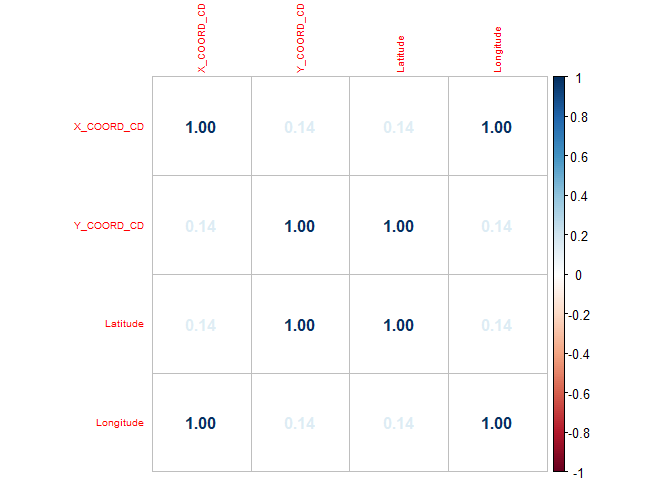
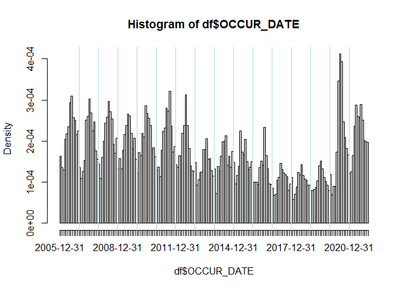
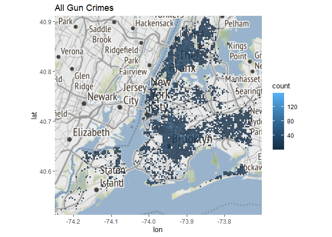
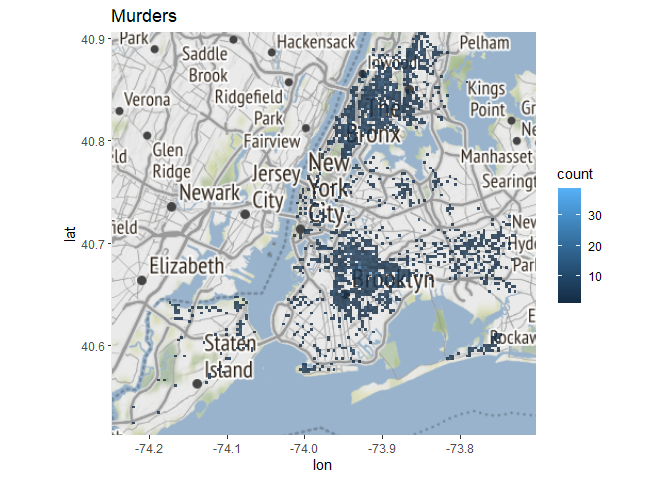
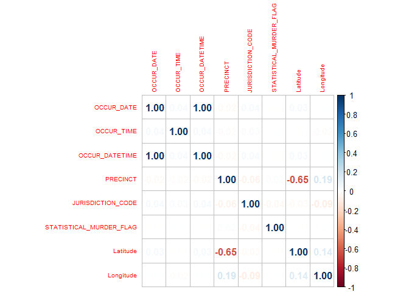

Violent gun crime is currently a hot topic in the debate over responsible gun control laws.
Here, we start with data reported by the city of New York comprised of every crime involving
a firearm where a police report was filed.  In this report, we we attempt to see if we can create a "Quick Response" system to predict the general location of a crime based on incomplete information.


We start by importing the required libraries.


```r
### Uncomment the line below to install packages

# install.packages('tidyverse', 'lubridate', 'ggmap', 'fastDummies', 'dbplyr', 'corrplot', 'missMDA', 'RANN', 'e1071', 'superml', 'ranger')
library(tidyverse)
library(lubridate)
library(ggmap)
library(fastDummies)
library(dbplyr)
library(corrplot)
library(missMDA)
library(RANN)
library(e1071)
library(superml)
library(ranger)
```
# Section 1: Data Preprocessing

## 1.1: Import Data
We download the data from the web server.  A static view of the data is provided (current as
of the time of writing) in case the web server cannot be accessed.

```r
#read csv file into dataframe
#url <- "./NYPD_Shooting_Incident_Data__Historic_.csv"
url <- "https://data.cityofnewyork.us/api/views/833y-fsy8/rows.csv?accessType=DOWNLOAD"
df <- read_csv(url)
```

## 1.2: Data Cleaning
A cursory view of the data reveals a few issues.  We have improper data types, missing values,
and some features that don't hold meaning for us.

```r
print(head(df))
```

```
## # A tibble: 6 × 19
##   INCIDE…¹ OCCUR…² OCCUR…³ BORO  PRECI…⁴ JURIS…⁵ LOCAT…⁶ STATI…⁷ PERP_…⁸ PERP_…⁹
##      <dbl> <chr>   <time>  <chr>   <dbl>   <dbl> <chr>   <lgl>   <chr>   <chr>  
## 1   2.41e7 08/27/… 05:35   BRONX      52       0 <NA>    TRUE    <NA>    <NA>   
## 2   7.77e7 03/11/… 12:03   QUEE…     106       0 <NA>    FALSE   <NA>    <NA>   
## 3   2.27e8 04/14/… 21:08   BRONX      42       0 COMMER… TRUE    <NA>    <NA>   
## 4   2.38e8 12/10/… 19:30   BRONX      52       0 <NA>    FALSE   <NA>    <NA>   
## 5   2.25e8 02/22/… 00:18   MANH…      34       0 <NA>    FALSE   <NA>    <NA>   
## 6   2.25e8 03/07/… 06:15   BROO…      75       0 <NA>    TRUE    25-44   M      
## # … with 9 more variables: PERP_RACE <chr>, VIC_AGE_GROUP <chr>, VIC_SEX <chr>,
## #   VIC_RACE <chr>, X_COORD_CD <dbl>, Y_COORD_CD <dbl>, Latitude <dbl>,
## #   Longitude <dbl>, Lon_Lat <chr>, and abbreviated variable names
## #   ¹​INCIDENT_KEY, ²​OCCUR_DATE, ³​OCCUR_TIME, ⁴​PRECINCT, ⁵​JURISDICTION_CODE,
## #   ⁶​LOCATION_DESC, ⁷​STATISTICAL_MURDER_FLAG, ⁸​PERP_AGE_GROUP, ⁹​PERP_SEX
## # ℹ Use `colnames()` to see all variable names
```
We will add a combined Date and Time column, to enable chronological sorting, and
fix the column data types.

```r
#add column OCCUR_DATETIME
df$OCCUR_DATETIME <- mdy_hms(paste(df$OCCUR_DATE, df$OCCUR_TIME))
df <- df %>% relocate(OCCUR_DATETIME, .after = OCCUR_TIME)
```


```r
#Fix data types
df$INCIDENT_KEY <- as.integer(df$INCIDENT_KEY)
df$OCCUR_DATE <- mdy(df$OCCUR_DATE)
df$OCCUR_TIME <- hms(df$OCCUR_TIME)
df$PRECINCT <- as.integer(df$PRECINCT)
df$JURISDICTION_CODE <- as.integer(df$JURISDICTION_CODE)
df$STATISTICAL_MURDER_FLAG <- as.integer(df$STATISTICAL_MURDER_FLAG)
df$BORO <- as.factor(df$BORO)
```


```r
head(df)
```

```
## # A tibble: 6 × 20
##   INCIDENT_KEY OCCUR_DATE OCCUR_TIME OCCUR_DATETIME      BORO    PRECI…¹ JURIS…²
##          <int> <date>     <Period>   <dttm>              <fct>     <int>   <int>
## 1     24050482 2006-08-27 5H 35M 0S  2006-08-27 05:35:00 BRONX        52       0
## 2     77673979 2011-03-11 12H 3M 0S  2011-03-11 12:03:00 QUEENS      106       0
## 3    226950018 2021-04-14 21H 8M 0S  2021-04-14 21:08:00 BRONX        42       0
## 4    237710987 2021-12-10 19H 30M 0S 2021-12-10 19:30:00 BRONX        52       0
## 5    224701998 2021-02-22 18M 0S     2021-02-22 00:18:00 MANHAT…      34       0
## 6    225295736 2021-03-07 6H 15M 0S  2021-03-07 06:15:00 BROOKL…      75       0
## # … with 13 more variables: LOCATION_DESC <chr>, STATISTICAL_MURDER_FLAG <int>,
## #   PERP_AGE_GROUP <chr>, PERP_SEX <chr>, PERP_RACE <chr>, VIC_AGE_GROUP <chr>,
## #   VIC_SEX <chr>, VIC_RACE <chr>, X_COORD_CD <dbl>, Y_COORD_CD <dbl>,
## #   Latitude <dbl>, Longitude <dbl>, Lon_Lat <chr>, and abbreviated variable
## #   names ¹​PRECINCT, ²​JURISDICTION_CODE
## # ℹ Use `colnames()` to see all variable names
```
\newpage
### Missing Data
Now lets have a look at the missing data; there are a few columns that seem to
account for the majority.\
JURISDICTION\_CODE has only 2 missing values.  The value "0" occurs 83.3% of time in
this categorical value (corresponding to "patrol" according to the meta data).
It makes sense to do a simple mode imputation of these points.\
LOCATION\_DESC has a large number of missing values,
and it's values are split into many categories, many of which are too ambiguous or
too specific for a general analysis.  If the data were more complete, this might be worth
imputing the missing values and trying to use.\
PERP\_AGE\_GROUP, PERP\_SEX, PERP\_RACE are all interesting features.  We presume the cause of
the majority of the missing data is that the perpetrator was simply not caught.
This is supported by the fact that the majority of NA values co-occur in those columns.
For these reasons, we do not think that it would be useful to impute the values for these data.  Instead, we propose that the rows or the columns be dropped.  We chose to drop the
columns in order to maintain our sample size.  Dropping the rows could also
be worth investigating, but we have not done so.


```r
#count null values in each column
for(i in colnames(df))
{
    print(paste("nulls in ", i,"=", sum(is.na(df[[i]])),",", round(100*sum(is.na(df[[i]]))/nrow(df)), "%"))
}
```

```
## [1] "nulls in  INCIDENT_KEY = 0 , 0 %"
## [1] "nulls in  OCCUR_DATE = 0 , 0 %"
## [1] "nulls in  OCCUR_TIME = 0 , 0 %"
## [1] "nulls in  OCCUR_DATETIME = 0 , 0 %"
## [1] "nulls in  BORO = 0 , 0 %"
## [1] "nulls in  PRECINCT = 0 , 0 %"
## [1] "nulls in  JURISDICTION_CODE = 2 , 0 %"
## [1] "nulls in  LOCATION_DESC = 14977 , 59 %"
## [1] "nulls in  STATISTICAL_MURDER_FLAG = 0 , 0 %"
## [1] "nulls in  PERP_AGE_GROUP = 9344 , 37 %"
## [1] "nulls in  PERP_SEX = 9310 , 36 %"
## [1] "nulls in  PERP_RACE = 9310 , 36 %"
## [1] "nulls in  VIC_AGE_GROUP = 0 , 0 %"
## [1] "nulls in  VIC_SEX = 0 , 0 %"
## [1] "nulls in  VIC_RACE = 0 , 0 %"
## [1] "nulls in  X_COORD_CD = 0 , 0 %"
## [1] "nulls in  Y_COORD_CD = 0 , 0 %"
## [1] "nulls in  Latitude = 0 , 0 %"
## [1] "nulls in  Longitude = 0 , 0 %"
## [1] "nulls in  Lon_Lat = 0 , 0 %"
```


```r
table(df$JURISDICTION_CODE)
```

```
## 
##     0     1     2 
## 21321    59  4214
```

```r
df$JURISDICTION_CODE[is.na(df$JURISDICTION_CODE)] <- 0
```


```r
unique(df$LOCATION_DESC)
```

```
##  [1] NA                          "COMMERCIAL BLDG"          
##  [3] "MULTI DWELL - PUBLIC HOUS" "GROCERY/BODEGA"           
##  [5] "MULTI DWELL - APT BUILD"   "BAR/NIGHT CLUB"           
##  [7] "PVT HOUSE"                 "HOSPITAL"                 
##  [9] "HOTEL/MOTEL"               "GAS STATION"              
## [11] "DEPT STORE"                "BEAUTY/NAIL SALON"        
## [13] "RESTAURANT/DINER"          "BANK"                     
## [15] "FAST FOOD"                 "DRY CLEANER/LAUNDRY"      
## [17] "NONE"                      "CLOTHING BOUTIQUE"        
## [19] "SOCIAL CLUB/POLICY LOCATI" "SMALL MERCHANT"           
## [21] "LIQUOR STORE"              "SUPERMARKET"              
## [23] "SHOE STORE"                "SCHOOL"                   
## [25] "STORE UNCLASSIFIED"        "CHAIN STORE"              
## [27] "DRUG STORE"                "TELECOMM. STORE"          
## [29] "JEWELRY STORE"             "FACTORY/WAREHOUSE"        
## [31] "CANDY STORE"               "VARIETY STORE"            
## [33] "ATM"                       "GYM/FITNESS FACILITY"     
## [35] "VIDEO STORE"               "DOCTOR/DENTIST"           
## [37] "LOAN COMPANY"              "PHOTO/COPY STORE"         
## [39] "CHECK CASH"                "STORAGE FACILITY"
```

```r
# Mean count of NA per row where PERP_SEX = NA
df_perp_na <-subset(df,is.na(PERP_SEX))

sum(is.na(df_perp_na))/nrow(df_perp_na)
```

```
## [1] 3.641031
```


```r
#remove columns with null values
df <- df[,colSums(is.na(df))==0]
```

### Pruning Co-linear and Low Information Features

There are a few features of this data that don't carry meaningful information for a predictive model.  According to the metadata, INCIDENT\_KEY is a randomly generated number, used to index the event.  Since a R data frame has an implicit index, this value can be safely dropped.\
X\_COORD\_CD and Y\_COORD\_CD columns names seem similar to Longitude" and Latitude, and a correlation analysis shows that both pairs of (X\_COORD\_CD, Longitude) and (Y\_COORD\_CD, Latitude) are 100% correlated.  This indicates redundant information, so we can drop one feature from each pair.  We chose to drop X\_COORD\_CD and Y\_COORD\_CD, simply for ease of use.  The metadata indicates that these values are midblock coordinates for the New York State Plane Coordinate System, and therefore might not be as universally applicable as Lat and Long.\
Lon\_Lat does not appear in the meta data, but it appears to be a concatenated string composed of the the Latitude and Longitude.  This redundant data can be disposed of.\


```r
cor_cols <- c('X_COORD_CD', 'Y_COORD_CD', 'Latitude', 'Longitude')

correlation <- cor(df[cor_cols])
corrplot(correlation, tl.cex=.6, method = "number")
```

<!-- -->

```r
#drop redundant and meaningless data
df <- subset(df, select=-c(INCIDENT_KEY, X_COORD_CD, Y_COORD_CD, Lon_Lat))
```

### A Closer Look at the Categorical Data

Now that our data is a little more clean and orderly, we can have a closer look at our actual data.\
First, we check the unique values of the categorical data, and find that three columns, VIC_AGE_GROUP, 
VIC_SEX, and VIC_RACE, have some values coded as "UNKNOWN" or "U".  Looking a little closer, we can see that these missing data only effect about 100 observations.  Because less than 0.5% of the data is missing, We are going to discard those rows.


```r
exclude = c("OCCUR_DATE", "OCCUR_TIME", "OCCUR_DATETIME", "Latitude", "Longitude", "STATISTICAL_MURDER_FLAG", "BORO", "PRECINCT", "JURISDICTION_CODE")
for(i in colnames(df[, !names(df) %in% exclude])){
  print(unique(df[,i]))
}
```

```
## # A tibble: 6 × 1
##   VIC_AGE_GROUP
##   <chr>        
## 1 25-44        
## 2 65+          
## 3 18-24        
## 4 <18          
## 5 45-64        
## 6 UNKNOWN      
## # A tibble: 3 × 1
##   VIC_SEX
##   <chr>  
## 1 F      
## 2 M      
## 3 U      
## # A tibble: 7 × 1
##   VIC_RACE                      
##   <chr>                         
## 1 BLACK HISPANIC                
## 2 WHITE                         
## 3 BLACK                         
## 4 WHITE HISPANIC                
## 5 ASIAN / PACIFIC ISLANDER      
## 6 AMERICAN INDIAN/ALASKAN NATIVE
## 7 UNKNOWN
```

```r
check_nonstandard_null <- function(){
  print(paste("Num of UNKNOWN in VIC_AGE_GROUP:",sum(df$VIC_AGE_GROUP == "UNKNOWN")))
  print(paste("Num of UNKNOWN in VIC_RACE:",sum(df$VIC_RACE == "UNKNOWN")))
  print(paste("Num of U in VIC_SEX:",sum(df$VIC_SEX == "U")))
}
check_nonstandard_null()
```

```
## [1] "Num of UNKNOWN in VIC_AGE_GROUP: 60"
## [1] "Num of UNKNOWN in VIC_RACE: 65"
## [1] "Num of U in VIC_SEX: 11"
```


```r
replace_value <- function(fdf, coln, orig, repl){
  for(i in 1:nrow(fdf)){
    if(fdf[i, coln] == orig){
      fdf[i, coln] <- repl
    }
  }
  return(fdf)
}

df <- replace_value(df,"VIC_AGE_GROUP", "UNKNOWN", NA)
df <- replace_value(df,"VIC_RACE", "UNKNOWN", NA)
df <- replace_value(df,"VIC_SEX", "U", NA)

check_nonstandard_null()
```

```
## [1] "Num of UNKNOWN in VIC_AGE_GROUP: NA"
## [1] "Num of UNKNOWN in VIC_RACE: NA"
## [1] "Num of U in VIC_SEX: NA"
```


```r
df <- na.omit(df)
```


```r
#sort by OCCUR_DATETIME
df <- df[order(df$OCCUR_DATETIME, decreasing = FALSE),]
```


```r
print(df)
```

```
## # A tibble: 25,482 × 12
##    OCCUR_DATE OCCUR_TIME OCCUR_DATETIME      BORO      PRECINCT JURISD…¹ STATI…²
##    <date>     <Period>   <dttm>              <fct>        <int>    <dbl>   <int>
##  1 2006-01-01 2H 0M 0S   2006-01-01 02:00:00 BRONX           48        0       0
##  2 2006-01-01 2H 22M 0S  2006-01-01 02:22:00 MANHATTAN       28        0       1
##  3 2006-01-01 2H 34M 0S  2006-01-01 02:34:00 QUEENS         114        0       1
##  4 2006-01-01 2H 34M 0S  2006-01-01 02:34:00 QUEENS         114        0       1
##  5 2006-01-01 3H 30M 0S  2006-01-01 03:30:00 BROOKLYN        67        0       0
##  6 2006-01-01 5H 51M 0S  2006-01-01 05:51:00 BRONX           44        0       0
##  7 2006-01-01 12H 30M 0S 2006-01-01 12:30:00 BROOKLYN        77        0       1
##  8 2006-01-01 19H 0M 0S  2006-01-01 19:00:00 QUEENS         106        0       0
##  9 2006-01-02 49M 0S     2006-01-02 00:49:00 BROOKLYN        90        2       1
## 10 2006-01-02 3H 59M 0S  2006-01-02 03:59:00 BROOKLYN        70        0       0
## # … with 25,472 more rows, 5 more variables: VIC_AGE_GROUP <chr>,
## #   VIC_SEX <chr>, VIC_RACE <chr>, Latitude <dbl>, Longitude <dbl>, and
## #   abbreviated variable names ¹​JURISDICTION_CODE, ²​STATISTICAL_MURDER_FLAG
## # ℹ Use `print(n = ...)` to see more rows, and `colnames()` to see all variable names
```
# Section 2: Exploratory Data Analysis

We can see below that the number of incidents seems to decrease in the wintertime.  Some possible causes could be the temperature outside, or perhaps another complicating factor that occurs on a yearly cycle.  Another interesting feature is the data is the apparent dip in activity in the years from 2018-2020, followed by a sharp increase in cases in 2020 and 2021.  The interval of 2020-21 corresponds with the onset of COVID-19 in New York City (March 2020 - Current).  It could be interesting to incorporate temperature and COVID data into this model, but we have not done so.


```r
#plot OCCUR_DATE as a histogram
v=seq(ymd('2007-01-01'),ymd('2021-01-01'), by = 'years')

hist(df$OCCUR_DATE, breaks = "months")
abline(v=v,col="light blue",lwd=1)
```

<!-- -->

To get a feel for where the crimes are happening, we plotted the physical location onto a series of heat maps.  We show data for: All crimes, murders, and non-murders.  Separating the heat maps into murders and non-murders did not yield valuable information, as there doesn't seem to be an obvious pattern to the difference.\
The overall map does show us that most events (69.4%) are happening in Brooklyn (40.5%) and the Bronx (28.9%).  In the case of Brooklyn, this is not neccisarily surprising.  According to data from https://www.citypopulation.de/en/usa/newyorkcity/ the population of Brooklyn accounts for 31.1% of the population of the city.  The Bronx, however, only comprises 16.7% of the city's population, and so may have a higher per capita rate than the rest of the city.


```r
plot_data_on_map <- function(df_map, title){

  height <- max(df_map$Latitude) - min(df_map$Latitude)
  width <- max(df_map$Longitude) - min(df_map$Longitude)

  nyc_borders <- c(bottom  = min(df_map$Latitude),
                     top     = max(df_map$Latitude),
                     left    = min(df_map$Longitude),
                     right   = max(df_map$Longitude))
  map <- get_stamenmap(nyc_borders, zoom = 10, maptype = "terrain")

  ggmap(map) + ggtitle(title) + geom_bin2d(data=df_map,bins=150, aes(x=Longitude, y=Latitude), alpha=.8)
}
plot_data_on_map(df, "All Gun Crimes")
```

```
## Source : http://tile.stamen.com/terrain/10/300/384.png
```

```
## Source : http://tile.stamen.com/terrain/10/301/384.png
```

```
## Source : http://tile.stamen.com/terrain/10/302/384.png
```

```
## Source : http://tile.stamen.com/terrain/10/300/385.png
```

```
## Source : http://tile.stamen.com/terrain/10/301/385.png
```

```
## Source : http://tile.stamen.com/terrain/10/302/385.png
```

```
## Warning: Removed 2 rows containing missing values (geom_tile).
```

<!-- -->

```r
plot_data_on_map(df[df$STATISTICAL_MURDER_FLAG == TRUE,], "Murders")
```

```
## Warning: Removed 2 rows containing missing values (geom_tile).
```

<!-- -->

```r
plot_data_on_map(df[df$STATISTICAL_MURDER_FLAG == FALSE,], "Non-lethal Gun Crimes")
```

```
## Warning: Removed 3 rows containing missing values (geom_tile).
```

<!-- -->

We plot the correlation matrix of the continuous variables, and we see that the only things that are strongly correlated are OCCUR_DATE and OCCUR_TIME with OCCUR_DATETIME.  This is obvious, since OCCUR_DATETIME is a concatenation of the other two.  We should drop either DATETIME, or both of the others.\
Additionally, precinct is negatively correlated with Latitude.  It is not surprising that the precinct is correlated with geographical location, as precincts are defined by their physical location.  Precinct number should either be treated categorically, or dropped entirely.

```r
df.num <- df %>% select(where(~ is.integer(.x) | is.double(.x)))
df.num <- transform(df.num, OCCUR_DATE=as.numeric(OCCUR_DATE),
                          OCCUR_TIME=as.numeric(OCCUR_TIME),
                          OCCUR_DATETIME=as.numeric(OCCUR_DATETIME))
correlation <- cor(df.num)
corrplot(correlation, tl.cex=.6, method = "number")
```

<!-- -->

# Section 3: Modelling

We will try to predict, from this data, which BORO a crime is occurring in.
First, we prepare our dataset to use for modelling.  We remove OCCUR_DATETIME and PRECINT, with the justification from section 2.  We also convert OCCUR_DATE and OCCUR_TIME to numeric values, as required for our models, and convert our categorical data to factors.  Our modelling strategy will be to use a multiple logistic regression to get a feel for the important factors in our data, then move on to more advanced models.  We have selected a support vector machine for its strong performance in high dimension, low density spaces.  We will also investigate a grid searched random forest.  Other options could be: a gradient boosted decision tree, or a neural network.
We also perform a train/test split on our data.  We will use a randomly selected 80% for training, and reserve the remaining 20% for validation.


```r
set.seed(42)
df_for_model <- subset(df, select=-c(OCCUR_DATETIME, PRECINCT, Latitude, Longitude))
df_for_model <- transform(df_for_model, OCCUR_DATE=as.numeric(OCCUR_DATE),
                          OCCUR_TIME=as.numeric(OCCUR_TIME))
```


```r
names <- c(3,4,5,6,7,8)
df_for_model[,names] <- lapply(df_for_model[,names] , factor)
glimpse(df_for_model)
```

```
## Rows: 25,482
## Columns: 8
## $ OCCUR_DATE              <dbl> 13149, 13149, 13149, 13149, 13149, 13149, 1314…
## $ OCCUR_TIME              <dbl> 7200, 8520, 9240, 9240, 12600, 21060, 45000, 6…
## $ BORO                    <fct> BRONX, MANHATTAN, QUEENS, QUEENS, BROOKLYN, BR…
## $ JURISDICTION_CODE       <fct> 0, 0, 0, 0, 0, 0, 0, 0, 2, 0, 0, 0, 0, 0, 0, 0…
## $ STATISTICAL_MURDER_FLAG <fct> 0, 1, 1, 1, 0, 0, 1, 0, 1, 0, 0, 0, 0, 0, 0, 1…
## $ VIC_AGE_GROUP           <fct> <18, 25-44, 25-44, 25-44, 18-24, 18-24, 25-44,…
## $ VIC_SEX                 <fct> M, M, M, M, M, M, M, M, M, M, M, M, M, M, M, M…
## $ VIC_RACE                <fct> BLACK, BLACK, BLACK, BLACK, BLACK, WHITE HISPA…
```

```r
#train test split
sample <- sample(c(TRUE, FALSE), nrow(df_for_model), replace=TRUE, prob=c(0.8,0.2))
train  <- df_for_model[sample, ]
test   <- df_for_model[!sample, ]
```
The results of the multiple linear regression show us a few things.  Values with any number of asterisks next to the row have a p-value of less than .05, and are therefore statistically significant.  It appears that most of our data is significant with the exception of race, time, and murder flag.


```r
model_glm = glm(BORO ~ ., family="binomial", data=train)
summary(model_glm)
```

```
## 
## Call:
## glm(formula = BORO ~ ., family = "binomial", data = train)
## 
## Deviance Residuals: 
##     Min       1Q   Median       3Q      Max  
## -2.2561  -1.1907   0.7021   0.7576   1.2966  
## 
## Coefficients:
##                                    Estimate Std. Error z value Pr(>|z|)    
## (Intercept)                       5.718e-01  8.315e-01   0.688 0.491616    
## OCCUR_DATE                       -4.092e-05  9.157e-06  -4.469 7.87e-06 ***
## OCCUR_TIME                       -1.495e-07  5.206e-07  -0.287 0.774030    
## JURISDICTION_CODE1                6.689e-01  3.668e-01   1.824 0.068223 .  
## JURISDICTION_CODE2                2.228e-01  4.470e-02   4.984 6.23e-07 ***
## STATISTICAL_MURDER_FLAG1         -1.798e-02  4.064e-02  -0.443 0.658089    
## VIC_AGE_GROUP18-24                1.094e-01  5.425e-02   2.016 0.043783 *  
## VIC_AGE_GROUP25-44                2.691e-01  5.407e-02   4.977 6.46e-07 ***
## VIC_AGE_GROUP45-64                3.080e-01  7.985e-02   3.857 0.000115 ***
## VIC_AGE_GROUP65+                  2.737e-01  2.034e-01   1.345 0.178522    
## VIC_SEXM                         -1.324e-01  5.642e-02  -2.347 0.018943 *  
## VIC_RACEASIAN / PACIFIC ISLANDER  1.699e+00  8.341e-01   2.037 0.041640 *  
## VIC_RACEBLACK                     1.187e+00  8.179e-01   1.451 0.146712    
## VIC_RACEBLACK HISPANIC            6.835e-02  8.189e-01   0.083 0.933480    
## VIC_RACEWHITE                     1.526e+00  8.262e-01   1.847 0.064741 .  
## VIC_RACEWHITE HISPANIC            1.382e-01  8.185e-01   0.169 0.865938    
## ---
## Signif. codes:  0 '***' 0.001 '**' 0.01 '*' 0.05 '.' 0.1 ' ' 1
## 
## (Dispersion parameter for binomial family taken to be 1)
## 
##     Null deviance: 24514  on 20407  degrees of freedom
## Residual deviance: 23382  on 20392  degrees of freedom
## AIC: 23414
## 
## Number of Fisher Scoring iterations: 4
```
The SVM classifier was run without parameter optimization, to investigate it's viability.  It appears that the model has more or less disregarded Staten Island, which makes some sense, because fewer than 3% of the data occurred there.  Manhattan is also strongly mis-classified, which is odd, because 12.7% of the data occurred there.  This model does not fit well in it's current state.


```r
classifier = svm(formula = BORO ~ .,
                 data = train,
                 type = 'C-classification',
                 kernel = 'sigmoid')
```


```r
y_pred = predict(classifier, newdata = test)
```


```r
conf_matrix = table(test[,3], y_pred)
conf_matrix
```

```
##                y_pred
##                 BRONX BROOKLYN MANHATTAN QUEENS STATEN ISLAND
##   BRONX           300      780         7    397             0
##   BROOKLYN        124     1283        13    593             1
##   MANHATTAN        85      365         8    192             0
##   QUEENS           68      454         0    260             2
##   STATEN ISLAND    14       78         1     49             0
```
A grid searched random forest is attempted below.  The resulting model provides slightly better than a random guess in it's current state, as evidenced by the AUC score.  This model is a poor fit in it's current state.

```r
parameters = list(max_features = c('sqrt', 'log'),
                 max_depth = seq(1,10,1))
rf <- RFTrainer$new(n_estimators = 100)
gst = GridSearchCV$new(rf, parameters, n_folds = 5, scoring = "auc")
```


```r
gst$fit(df_for_model,"BORO")
```

```
## [1] "entering grid search"
## [1] "In total, 20 models will be trained"
```

```r
gst$best_iteration()
```

```
## $max_features
## [1] "log"
## 
## $max_depth
## [1] " 1"
## 
## $auc_avg
## [1] 0.59544
## 
## $auc_sd
## [1] 0.003634214
```

# Section 4: Conclusions and areas of further study

Our most successful model was also the simplest: the logistic regression.  The other machine learning models described do not fit well.  This could be a result of either poor optimization, or not enough relevant data.  In order to improve their predictive accuracy, we might look to add to our data set.  Since we suspect that outdoor conditions might influence our data, it could be of interest to include meteorologic data.  Additionally, rates seemed to be decreasing until the onset of COVID-19.  It could make sense to include data such as number of cases per day etc.
We could also slice the data into smaller chunks for analysis.  Perhaps precinct would be a better dependent variable, or the data might become more clear when looked at individually by BORO. There are a lot of ares for improvement and further study, and this investigation could serve as a jumping off point.
